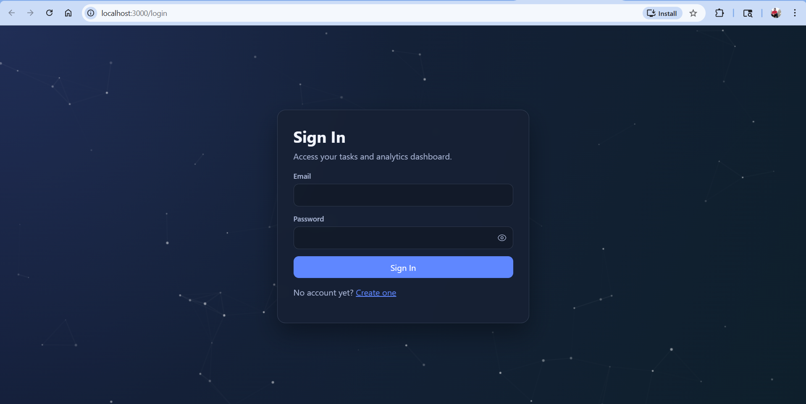
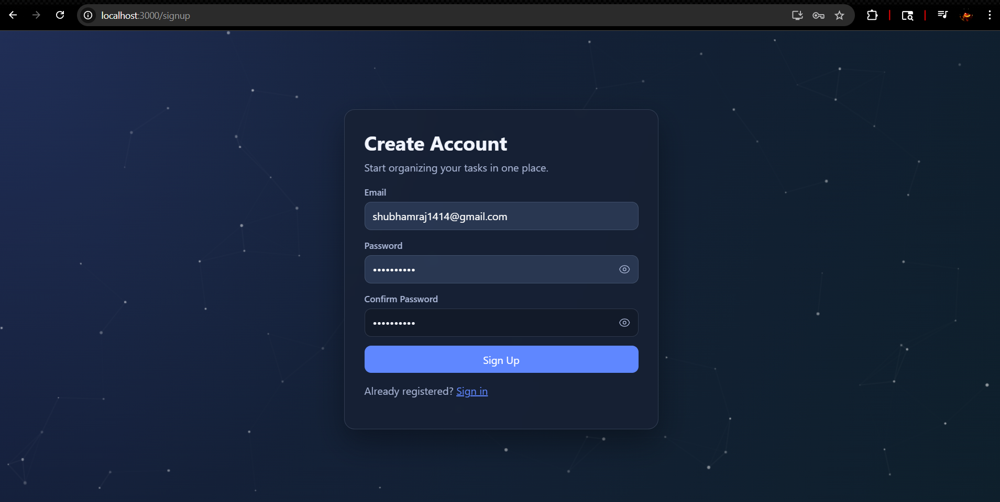
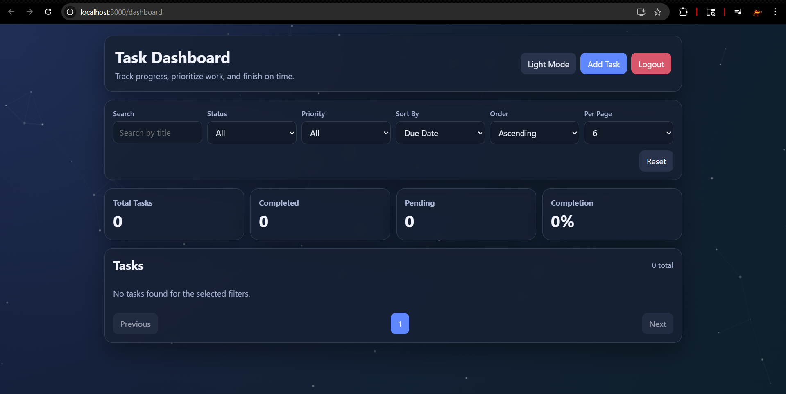
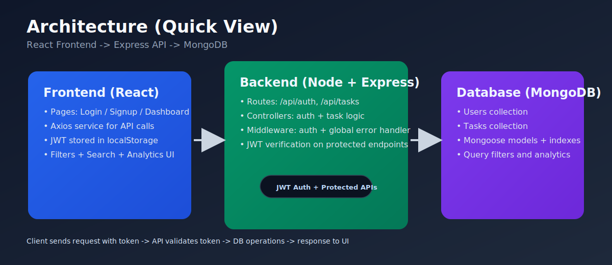

 # Task Manager Pro

A full-stack MERN application to manage tasks with secure authentication, clean CRUD workflows, filtering/search, and a simple analytics dashboard.

## 🌐 Live Demo
- Live: https://task-manager-full-stack-web-application-1.onrender.com/login
- Backend: https://task-manager-full-stack-web-application.onrender.com/

## 🚀 Overview
Task Manager Pro helps users organize daily work in one place. It is designed for real usage where priorities change, deadlines matter, and quick progress visibility is important.

## ⚡ Key Highlights
- Secure JWT Authentication
- User-specific task isolation
- Real-time analytics dashboard
- Clean MVC backend architecture

## 📸 Screenshots
### Sign In


### Sign Up


### Dashboard


## 🛠 Tech Stack
### Frontend
- React (Hooks + TypeScript)
- Axios
- React Router

### Backend
- Node.js
- Express.js

### Database
- MongoDB (Mongoose)

### Authentication
- JWT (JSON Web Tokens)
- bcryptjs

## ✨ Features
### Authentication
- Signup and Login
- JWT-based protected routes

### Task Management
- Create task
- Get user-specific tasks
- Update task
- Delete task
- Mark task as completed

### Filtering & Search
- Filter by status (`Todo`, `In Progress`, `Done`)
- Filter by priority (`Low`, `Medium`, `High`)
- Search by title

### Analytics Dashboard
- Total tasks
- Completed tasks
- Pending tasks
- Completion percentage

## 🧱 Architecture
`React UI -> Axios API Calls -> Express Routes/Controllers -> MongoDB`

### Quick Architecture View


### Folder Structure
```bash
task-manager/
  backend/
    config/
    controllers/
    middleware/
    models/
    routes/
    server.js
  frontend/
    src/
      components/
      pages/
      services/
      App.tsx
  docs/
    architecture-quick-view.svg
  README.md
```

## 📡 API Endpoints
### Auth
- `POST /api/auth/register`
- `POST /api/auth/login`

### Tasks
- `GET /api/tasks`
- `POST /api/tasks`
- `PUT /api/tasks/:id`
- `DELETE /api/tasks/:id`
- `PATCH /api/tasks/:id/complete`

### Analytics
- `GET /api/tasks/analytics`

## ⚙️ Local Setup
### Backend
```bash
cd backend
npm install
npm run dev
```

### Frontend
Open a new terminal:
```bash
cd frontend
npm install
npm start
```

Default URLs:
- Frontend: `http://localhost:3000`
- Backend: `http://localhost:5000`

## 🔐 Environment Variables
Create `.env` inside `backend/`:

```env
MONGO_URI=
JWT_SECRET=
CLIENT_URL=
```

If your backend expects `MONGODB_URI`, keep both keys:

```env
MONGO_URI=mongodb+srv://<username>:<password>@<cluster-url>/?retryWrites=true&w=majority
MONGODB_URI=mongodb+srv://<username>:<password>@<cluster-url>/?retryWrites=true&w=majority
JWT_SECRET=your_secret_here
CLIENT_URL=http://localhost:3000
PORT=5000
```

## 💻 Run on Another System
1. Clone repository
2. Install dependencies in `backend` and `frontend`
3. Add backend `.env`
4. Run backend and frontend in separate terminals

## 🔮 Future Improvements
- Better pagination UI
- Notifications/reminders
- Team collaboration support
- More test coverage

## 👤 Author
**Shubham Raj Sharma**

---
Made with ❤️ and modern technologies by Shubham Raj Sharma
